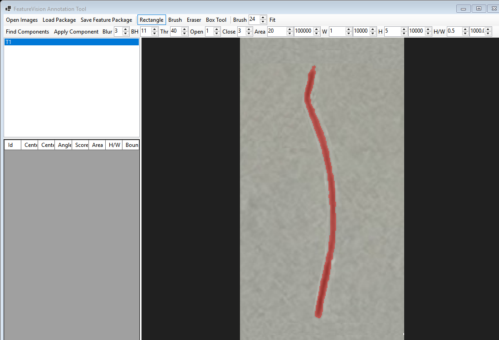
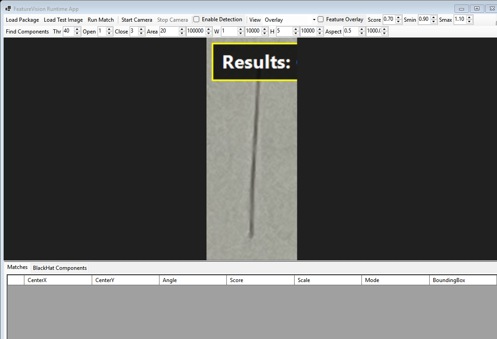

# FeatureVisionDetector

FeatureVisionDetector is an early-stage, offline machine-vision toolkit for Windows. It lets an operator annotate target features in sample images, save those samples as a portable `.fvfeature` package, and detect similar features in still images or a live DirectShow camera feed.

The project uses deterministic classical computer vision rather than model training or cloud inference. It is intended for industrial inspection prototypes, QA workflows, camera-based positioning experiments, and C# developers learning how to assemble an end-to-end OpenCvSharp application.

> **Status:** `v0.1.0-alpha.1` development preview. The core package, rectangle/brush/eraser annotation flow, package I/O, static-image detection, and live camera preview are implemented. Polygon annotation is **not implemented** in the current UI. APIs and the package format may still change before `1.0`.

## Screenshots

### Annotation tool



### Runtime detector



## What is included

- **FeatureVision.AnnotationTool** — opens multiple images; supports rectangle, brush, eraser, and measurement-box interactions; computes center, rotation, area, and bounds; saves and reloads feature packages.
- **FeatureVision.RuntimeApp** — loads a package or test image, opens a DirectShow camera, runs local detection, and displays centers, angles, scores, bounding boxes, diagnostics, and overlays.
- **FeatureVision.Core** — contains package models and validation, ZIP/JSON I/O, geometry analysis, rotated-template generation, matching, black-hat component detection, shape scoring, and non-maximum suppression.
- **FeatureVision.Camera** — owns the OpenCvSharp camera lifecycle and cancellable frame loop.

Feature packages are ordinary ZIP archives with a `.fvfeature` extension. Each package contains `feature.json`, source images, and aligned mask images. See [the format specification](docs/feature-file-format.md).

## Requirements

- Windows 10 or Windows 11
- [.NET 8 SDK](https://dotnet.microsoft.com/download/dotnet/8.0)
- Visual Studio 2022 is optional
- A DirectShow-compatible camera is optional; static images work without one

The applications use OpenCvSharp and its Windows native runtime through NuGet.

## Build and run

```powershell
git clone https://github.com/csfishy/FeatureVisionDetector.git
cd FeatureVisionDetector
dotnet restore FeatureVisionDetector.sln
dotnet build FeatureVisionDetector.sln --configuration Release
```

Run the annotation tool:

```powershell
dotnet run --project src/FeatureVision.AnnotationTool/FeatureVision.AnnotationTool.csproj
```

Run the detector:

```powershell
dotnet run --project src/FeatureVision.RuntimeApp/FeatureVision.RuntimeApp.csproj
```

Run automated tests:

```powershell
dotnet test FeatureVisionDetector.sln --configuration Release
```

## Basic workflow

1. Open `FeatureVision.AnnotationTool` and choose **Open Images**.
2. Mark a target with **Rectangle** or refine its mask with **Brush** and **Eraser**. Polygon selection remains a roadmap item.
3. Review the calculated center, angle, area, and component diagnostics.
4. Choose **Save Feature Package** to write a `.fvfeature` file.
5. Open `FeatureVision.RuntimeApp`, load that package, and load a test image or start a camera.
6. Enable detection and tune the score, scale, morphology, and shape controls for the scene.

The runtime performs all image processing locally. It does not call OpenAI or any other network API.

## Current limitations

- Polygon annotation and the shared `MaskBuilder` operations are not implemented.
- The package format is versioned as `1.0`, but the application itself is still alpha and compatibility may change before the first stable release.
- Detection uses classical template/component techniques; it is sensitive to lighting, contrast, scale, and scene clutter.
- Windows and DirectShow are the only supported runtime platform and camera backend.
- The repository does not yet claim production deployments, package-registry downloads, or broad adoption.

See [requirements](docs/requirements.md), the [development plan](docs/development-plan.md), and the [test checklist](docs/test-checklist.md) for detailed scope.

## Security

`.fvfeature` files and images are untrusted inputs. The reader limits archive entries and expanded sizes, validates relative paths and numeric settings, and checks extraction containment before passing image data to System.Drawing or native OpenCV. These controls reduce risk but do not make arbitrary files safe. Review [SECURITY.md](SECURITY.md) before reporting a vulnerability.

## Contributing

Issues and focused pull requests are welcome. Before submitting a change:

- keep image-processing and package logic out of WinForms controls;
- add or update tests for package parsing, geometry, and matching changes;
- update the format document when serialized behavior changes;
- do not describe planned functionality as complete; and
- run the Release build and test suite locally.

## License

FeatureVisionDetector is available under the OSI-approved [MIT License](LICENSE).
